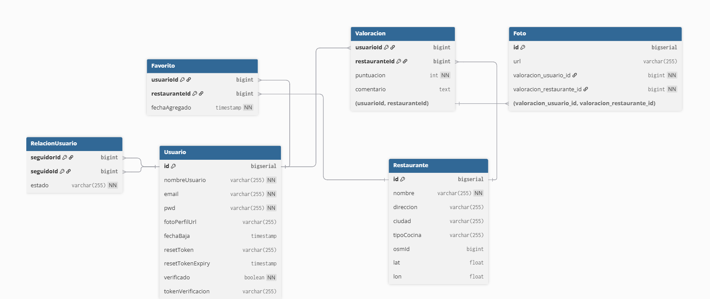

# api-training

Desarrollo de un API con Spring Boot

1. Controlador con varios servicios tipo (POST, GET , PUT o PATCH) y con acceso a BBDD
2. Implementar algún mecanismo de seguridad en el API 
3. Llamada a un API externo con un cliente rest tipo feign o webclient,...
4. Cache
5. Validaciones y logs
6. Manejo de errores y excepciones
7. Documentación OpenAPI Swagger con springdoc
8. Circuit breaker // resilience4j


## 🧠 Acerca del proyecto
Este proyecto es una **API RESTful** desarrollada con **Spring Boot**
Sigue una arquitectura por capas (**Controlador**, **Servicio**, **Repositorio**) y aplica buenas prácticas de desarrollo como seguridad, validaciones, caché ,manejo centralizado de errores y paginación.

---

## 🎯 Objetivo
El objetivo del proyecto es desarrollar una **API funcional con Spring Boot** que incluya los siguientes aspectos:

1. Controlador con servicios tipo **POST**, **GET**, **PUT** o **PATCH** con acceso a una base de datos.  
2. Mecanismos de **seguridad** implementados con Spring Security.  
3. **Consumo de una API externa** usando`FeignClient`.  
4. **Sistema de caché** para mejorar el rendimiento.  
5. **Validaciones** y **registro de logs**.  
6. **Manejo de errores y excepciones** personalizado y centralizado.  
7. **Documentación OpenAPI** (Swagger UI) con **springdoc-openapi**.  
8. Implementación del patrón **Circuit Breaker** con **Resilience4j**.
9. **Paginación**.

---

## ⚙️ Métodos soportados

http://localhost:8080/swagger-ui.html
---

## 🗄️ Base de datos
- **Motor de base de datos:** PostgreSQL  
- Se utiliza **Spring Data JPA** y **Jakarta Persistence** para el mapeo objeto-relacional (ORM) y la gestión de entidades.
- **Diagrama de Entidad-Relación:**

- Se ha añadido paginación en las llamadas de GET para Users(usuarios) y Restaurantes

---

## 🔐 Seguridad

La seguridad está implementada con **Spring Security**.  
Todos los endpoints requieren autenticación previa.
Tambien se ha implementado JWT.

---

## 🌍 API externa
La aplicación consume dos APIs externas en los siguientes URLs:<br>
https://nominatim.openstreetmap.org/search<br>
https://overpass-api.de/api/interpreter

Esta integración se realiza mediante **FeignClient**.

---

## ⚡ Caché

Implementada caché en todo el código.

---

## ✅ Validaciones
La API cuenta con validaciones estándar y personalizadas.

- **Validaciones estándar:** `@NotNull`, `@NotBlank`, `@Size` etc.  

Las solicitudes con datos inválidos generan respuestas de error estructuradas, gestionadas por el manejador global de excepciones.

---

## 🧾 Registro de logs
Se realizan logs con el detalle de las operaciones necesario para entender los procesos internamente.
Se realizan con: 
- Spring JPA y Hibernate: proporcionan logs automáticos relacionados con las operaciones de persistencia y consultas a la base de datos.

- SLF4J: se utiliza como capa de abstracción de logging para registrar mensajes de trazabilidad y eventos dentro de la aplicación.

---

## 🚨 Manejo de errores y excepciones
El manejo de errores se realiza de forma centralizada mediante un `@ControllerAdvice`.

**Excepciones personalizadas:**
 
- ``handleGlobalException`` → se lanza cuando ocurren errores no esperados.

- ``handleResourceNotFoundException`` → se lanza cuando hay un recursos no encontrado.

- ``handleConflictException`` → se lanza cuando hay un conflicto.

- ``handleBadRequestException`` → se lanza cuando se ha hecho mal la peticion.

- ``handleLockedException`` → se lanza cuando hay un intentyo de login en cuenta no verificada.

- ``handleBadCredentialsException`` → se lanza cuando las credenciales son incorrectas.

- ``ValoracionDuplicadaException`` → se lanza cuando ya hay una valoracion hecha en un restaurante por esa persona.


Las respuestas de error se devuelven en formato JSON, con un mensaje claro y el código HTTP correspondiente.

---


## 🔁 Circuit Breaker
Implementado Circuit Breaker en OpenStreetMapServiceImpl

---

## 🚀 Uso
La aplicación puede ejecutarse de forma local o dentro de un contenedor Docker.

### Requisitos previos
- **Docker** y **Docker Compose** instalados  
- **Java 17** o superior  
- **Maven** o **Gradle**

---

## 🐳 Comandos Docker

```bash
# Iniciar la base de datos y la aplicación
docker-compose up -d

# Detener los contenedores
docker-compose down
sudo systemctl stop postgresql


 
